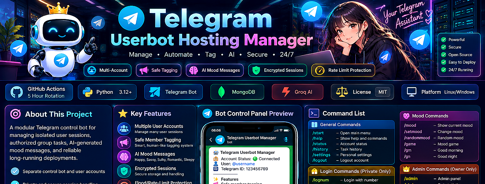
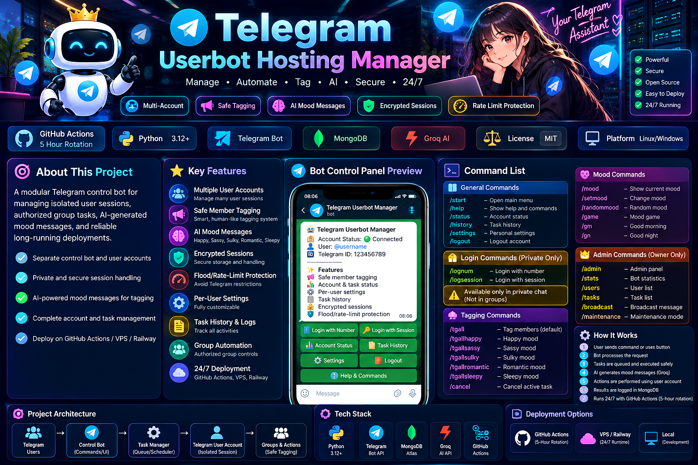

# 🤖 Telegram Userbot Hosting Manager

<p align="center">
  <a href="https://github.com/tss2015/tssuserbothosting">
    
  </a>
</p>

<p align="center">
  <b>Secure • Modular • AI-Powered • Multi-Account • Deployment Ready</b>
</p>

<p align="center">
  <a href="https://github.com/tss2015/tssuserbothosting"></a>
  <a href="https://github.com/tss2015/tssuserbothosting/actions"></a>
  <a href="https://www.python.org/"></a>
  <a href="https://core.telegram.org/bots/api"></a>
  <a href="https://www.mongodb.com/atlas"></a>
  <a href="https://groq.com/"></a>
</p>

<!-- Graphical section navigation: every button links to its matching section ID. -->
<p align="center">
  <a href="#features"></a>
  <a href="#commands"></a>
  <a href="#ai-mood"></a>
  <a href="#security"></a>
  <a href="#architecture"></a>
  <a href="#configuration"></a>
  <a href="#installation"></a>
  <a href="#deployment"></a>
</p>

<p align="center">
  <a href="#home"></a>
</p>

> 🧭 Each graphical button above jumps directly to its corresponding section header below.


---

<h1 id="home">🏠 Home</h1>

A modular Telegram control bot for managing isolated user sessions, authorized group tasks, AI-generated mood messages, and long-running deployments.

```text
👤 User / Group Admin
        │
        ▼
🤖 Control Bot
        │
        ├── 🔐 Per-user Session Manager
        │          │
        │          ▼
        │      📱 Telegram User Account
        │                  │
        │                  ▼
        │              👥 Authorized Group
        │
        ├── 🧠 Groq AI
        ├── 🍃 MongoDB
        └── ❤️ Health Endpoint
```

### 🖥️ Bot Control Panel

```text
┌─────────────────────────────────────────────────┐
│ 🤖 Telegram Userbot Manager                     │
│ ─────────────────────────────────────────────── │
│ 🔐 Account Status: 🟢 Connected                 │
│ 👤 User: @username                              │
│ 🆔 Telegram ID: 123456789                       │
│                                                 │
│ ✨ Features                                      │
│ 📢 Safe member tagging                          │
│ 📊 Account & task status                        │
│ ⚙️ Per-user settings                            │
│ 📜 Task history                                 │
│ 🔐 Encrypted sessions                           │
│ 🛡️ Flood/rate-limit protection                 │
│                                                 │
│ 📱 Login Number       🔑 Login Session          │
│ 📊 Status             📜 History                │
│ ⚙️ Settings           🚪 Logout                 │
│ ❓ Help & Commands                               │
└─────────────────────────────────────────────────┘
```

> 🔒 **Login commands are private-chat commands.** `/lognum` and `/logsession` should not be operated from groups.

<p align="right"><a href="#home"></a></p>

---

<h1 id="features">✨ Features</h1>

| Feature | Description |
|---|---|
| 👤 Multi-account support | Maintain isolated Telegram user sessions |
| 🔐 Encrypted sessions | Fernet-protected session data |
| 📢 Group tagging | `/tagall` plus five mood-specific commands |
| 🧠 Groq AI | AI-generated mood-aware messages |
| 🎭 Five moods | Happy, Sassy, Sulky, Romantic and Sleepy |
| 📊 Task management | Status, task history, progress and cancellation |
| ⚙️ Per-user settings | Delay, batch size and task limits |
| 🛡️ FloodWait handling | Respect Telegram rate-limit responses |
| 👑 Admin panel | Statistics, users, tasks, broadcast and maintenance |
| 💚 Health endpoint | HTTP health monitoring |
| ⏱️ GitHub rotation | Scheduled ephemeral runner workflow |
| 🖥️ VPS deployment | Ubuntu/systemd deployment files |

<p align="right"><a href="#home"></a></p>

---

<h1 id="commands">📚 Commands</h1>

## 🏠 General

```text
/start       Open the main control panel
/help        Show help and commands
/status      Show connected account status
/settings    Open personal tagging settings
/history     Show recent task history
/logout      Disconnect the current account
```

## 🔐 Login — Private Chat Only

```text
/lognum      Login using a phone number
/logsession  Login using an existing StringSession
```

Do not send OTP codes, 2FA passwords, or StringSessions into public chats.

## 📢 Group Tagging

```text
/tagall
/tgallhappy
/tgallsassy
/tgallsulky
/tgallromantic
/tgallsleepy
/cancel
```

Explicit mood selection:

```text
/tagall happy
/tagall sassy
/tagall sulky
/tagall romantic
/tagall sleepy
```

> Group tagging is intended for authorized administrators and uses the requesting user's connected Telegram session.

## 🎭 Mood

```text
/mood
/setmood sassy
/randommood
/game
/gm
/gn
```

## 👑 Admin

```text
/admin
/stats
/users
/tasks
/broadcast
/maintenance
```

<p align="right"><a href="#home"></a></p>

---

<h1 id="ai-mood">🧠 AI Mood</h1>

Supported styles:

| Mood | Intended style |
|---|---|
| 😄 Happy | Cheerful and energetic |
| 😏 Sassy | Playful and teasing |
| 😤 Sulky | Cute and mildly dramatic |
| 💫 Romantic | Soft and cute |
| 😴 Sleepy | Short and sleepy |

### Groq configuration

```env
GROQ_API_KEY=your_key
GROQ_MODEL=llama-3.3-70b-versatile
GROQ_TIMEOUT=20
```

The AI service generates mood-aware text; the Telegram session layer performs the authorized Telegram action.

<p align="right"><a href="#home"></a></p>

---

<h1 id="security">🔐 Security</h1>

### Fernet session encryption

Generate a random Fernet key:

```bash
python -c "from cryptography.fernet import Fernet; print(Fernet.generate_key().decode())"
```

Store the complete output as:

```env
SESSION_ENCRYPTION_KEY=your_generated_key
```

Do not derive encryption keys from:

```text
❌ Date of birth
❌ Mobile number
❌ Telegram ID
❌ Name
❌ Other predictable personal information
```

### Authentication data

OTP and 2FA credentials are intended to remain temporary and should not be persisted as application secrets.

### Rate-limit protection

The project does not attempt to bypass:

```text
Telegram FloodWait
Telegram rate limits
Anti-spam controls
Account restrictions
Platform safety systems
```

<p align="right"><a href="#home"></a></p>

---

<h1 id="architecture">🏗️ Architecture</h1>

```text
┌──────────────────────────┐
│ 👤 Telegram User/Admin   │
└────────────┬─────────────┘
             │
             ▼
┌──────────────────────────┐
│ 🤖 Control Bot           │
│ Commands + Inline UI     │
└────────────┬─────────────┘
             │
      ┌──────┼───────────┐
      │      │           │
      ▼      ▼           ▼
   🧠 Groq  🍃 MongoDB  📋 Task Manager
      │      │           │
      └──────┼───────────┘
             ▼
┌──────────────────────────┐
│ 🔐 Session Manager       │
│ Per-user encrypted state │
└────────────┬─────────────┘
             ▼
┌──────────────────────────┐
│ 📱 Telegram User Account │
│ Telethon client/session  │
└────────────┬─────────────┘
             ▼
┌──────────────────────────┐
│ 👥 Authorized Groups     │
│ Tagging / Group Actions  │
└──────────────────────────┘
```

### MongoDB collections

```text
🍃 users
🍃 tasks
🍃 events
🍃 moods
```

<p align="right"><a href="#home"></a></p>

---

<h1 id="configuration">🧩 Configuration</h1>

Example environment:

```env
BOT_TOKEN=
API_ID=
API_HASH=

MONGO_URI=
DATABASE_NAME=telegram_userbot

SESSION_ENCRYPTION_KEY=
ADMIN_IDS=

TAG_DELAY=5
TAG_BATCH_SIZE=5
MAX_MEMBERS_PER_TASK=5000

AUTH_TIMEOUT=300
HEALTH_PORT=8080
MAINTENANCE=false
LOG_LEVEL=INFO

ENABLE_SCHEDULED_MESSAGES=false

GROQ_API_KEY=
GROQ_MODEL=llama-3.3-70b-versatile
GROQ_TIMEOUT=20
```

### One-member-at-a-time tagging

For one-member-at-a-time operation:

```env
TAG_BATCH_SIZE=1
```

### GitHub Actions secrets

Keep sensitive values in GitHub Actions Secrets:

```text
BOT_TOKEN
API_ID
API_HASH
MONGO_URI
SESSION_ENCRYPTION_KEY
ADMIN_IDS
GROQ_API_KEY
```

<p align="right"><a href="#home"></a></p>

---

<h1 id="installation">⚙️ Installation</h1>

## 1. Clone

```bash
git clone https://github.com/tss2015/tssuserbothosting.git
cd tssuserbothosting
```

## 2. Create environment

```bash
cp .env.example .env
```

On Windows, create `.env` manually from `.env.example` if `cp` is unavailable.

## 3. Install dependencies

```bash
python -m pip install -r requirements.txt
```

## 4. Validate

```bash
python -m compileall -q .
pytest -q
```

## 5. Start

```bash
python bot.py
```

<p align="right"><a href="#home"></a></p>

---

<h1 id="deployment">🚀 Deployment</h1>

## GitHub Actions — 5-hour rotation

```text
GitHub Actions
       │
       ▼
  Checkout code
       │
       ▼
  Python 3.12
       │
       ▼
  Install dependencies
       │
       ▼
  Validate secrets
       │
       ▼
  Compile + pytest
       │
       ▼
    Start bot
       │
       ▼
 ~4h 45m runtime
       │
       ▼
 Graceful shutdown
```

Recommended timeout:

```bash
timeout --signal=TERM --kill-after=30s 17100s python bot.py
```

`17100s` = 4 hours 45 minutes.

> Note: the current repository workflow should be kept synchronized with this value if you use the 5-hour rotation design.

## VPS / systemd

The project includes:

```text
deploy/telegram-userbot.service
deploy/install.sh
deploy/update.sh
deploy/backup_mongodb.md
```

Typical systemd setup:

```bash
sudo cp deploy/telegram-userbot.service /etc/systemd/system/
sudo systemctl daemon-reload
sudo systemctl enable --now telegram-userbot
```

Status:

```bash
sudo systemctl status telegram-userbot
```

Logs:

```bash
sudo journalctl -u telegram-userbot -f
```

<p align="right"><a href="#home"></a></p>

---

# 🧪 Testing

```bash
python -m compileall -q .
pytest -q
```

Workflows are stored in:

```text
.github/workflows/
```

---

# 🗂️ Project Structure

```text
tssuserbothosting/
├── .github/
│   └── workflows/
│       ├── ci.yml
│       └── rotation.yml
│
├── assets/
│   ├── badges/
│   └── nav/
│
├── deploy/
│   ├── backup_mongodb.md
│   ├── install.sh
│   ├── telegram-userbot.service
│   └── update.sh
│
├── handlers/
│   ├── account.py
│   ├── admin.py
│   ├── authentication.py
│   ├── help.py
│   ├── history.py
│   ├── mood.py
│   ├── settings.py
│   ├── start.py
│   └── tagall.py
│
├── services/
│   ├── ai_mood.py
│   ├── health.py
│   ├── member_collector.py
│   ├── mention_manager.py
│   ├── mood.py
│   ├── rate_limiter.py
│   ├── scheduled_messages.py
│   ├── session_manager.py
│   ├── task_manager.py
│   └── telegram_client.py
│
├── tests/
│   ├── test_helpers.py
│   ├── test_mood.py
│   ├── test_security.py
│   ├── test_settings.py
│   ├── test_tagall_ai.py
│   └── test_task_manager.py
│
├── utils/
│   ├── helpers.py
│   ├── logging.py
│   └── security.py
│
├── bot.py
├── config.py
├── database.py
├── .env.example
├── Procfile
├── pytest.ini
├── requirements.txt
└── runtime.txt
```

---

# 🖼️ Project Visual Overview

<p align="center">
  
</p>

---

# 🛡️ Responsible Use

Use this project only for Telegram accounts, groups and actions where you have the necessary permissions.

Do not use it to evade:

```text
FloodWait
Rate limits
Anti-spam restrictions
Account restrictions
Platform safety controls
```

---

# 🔗 Repository

<p align="center">
  <a href="https://github.com/tss2015/tssuserbothosting">
    
  </a>
  <a href="https://github.com/tss2015/tssuserbothosting/actions">
    
  </a>
  <a href="https://core.telegram.org/bots/api">
    
  </a>
</p>

<p align="center">
  <a href="#home"></a>
</p>

<p align="center">
  ⭐ <b>If this project is useful to you, consider starring the repository.</b> ⭐
</p>
